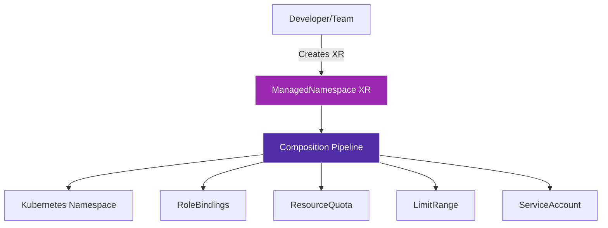

# ManagedNamespace Template

## Overview

The **ManagedNamespace** template is a Crossplane Composite Resource Definition (XRD) that provides automated Kubernetes namespace management with built-in RBAC, resource quotas, and organizational policies.

!!! info "Key Features"
    - 🚀 **Automated Namespace Creation** - Self-service namespace provisioning
    - 🔐 **RBAC Integration** - Automatic role bindings and service account creation
    - 📊 **Resource Quotas** - Built-in resource limits and consumption controls
    - 🏷️ **Metadata Management** - Consistent labeling and annotation strategies
    - ♻️ **Lifecycle Management** - Automated cleanup and resource recycling

## What is ManagedNamespace?

ManagedNamespace is a Crossplane XR (Composite Resource) that abstracts the complexity of creating and managing Kubernetes namespaces. It ensures consistency, security, and compliance across all namespaces in your cluster.

### Architecture



## Use Cases

### 1. Team Namespace Provisioning
Enable development teams to self-provision namespaces with appropriate permissions and resource limits.

### 2. Environment Isolation
Create isolated environments (dev, staging, prod) with consistent configurations and policies.

### 3. Multi-Tenant Clusters
Safely share clusters between multiple teams or applications with proper isolation and resource management.

### 4. Compliance and Governance
Enforce organizational policies for resource usage, security, and metadata standards.

## Quick Example

```yaml
apiVersion: openportal.dev/v1alpha1
kind: ManagedNamespace
metadata:
  name: team-platform
spec:
  namespace: platform-team
  owner: platform@company.com
  purpose: "Platform team development environment"
  resourceQuota:
    requests.cpu: "10"
    requests.memory: "20Gi"
    limits.cpu: "20"
    limits.memory: "40Gi"
```

## Benefits

| Benefit | Description |
|---------|-------------|
| **Consistency** | All namespaces follow the same patterns and policies |
| **Security** | RBAC and network policies are automatically configured |
| **Efficiency** | Reduces manual work and human error |
| **Scalability** | Easy to manage hundreds of namespaces |
| **Compliance** | Enforces organizational standards automatically |

## Getting Started

To start using the ManagedNamespace template:

1. [Install the template](getting-started/installation.md) in your Crossplane environment
2. Review the [configuration options](getting-started/configuration.md)
3. Create your first [ManagedNamespace](getting-started/quick-start.md)

## Support

- 📖 [API Reference](api/managednamespace.md)
- 🐛 [Issue Tracker](https://github.com/open-service-portal/template-namespace/issues)
- 💬 [Discussions](https://github.com/open-service-portal/template-namespace/discussions)
- 📦 [Releases](https://github.com/open-service-portal/template-namespace/releases)

## Version Information

| Version | Crossplane | Kubernetes | Status |
|---------|------------|------------|--------|
| v3.0.1 | v1.17+ | v1.28+ | Current |
| v2.x | v1.14+ | v1.26+ | Deprecated |
| v1.x | v1.12+ | v1.24+ | End of Life |

---

!!! tip "Next Steps"
    Ready to get started? Head over to the [Installation Guide](getting-started/installation.md) to deploy the ManagedNamespace template in your cluster.