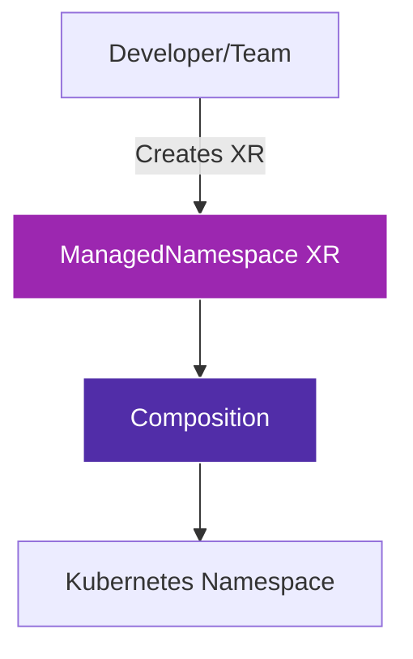

# ManagedNamespace Template

## Overview

The **ManagedNamespace** template is a Crossplane Composite Resource Definition (XRD) that provides automated Kubernetes namespace management.

!!! info "Key Features"
    - 🚀 **Automated Namespace Creation** - Self-service namespace provisioning
    - 🏷️ **Metadata Management** - Consistent labeling via Backstage
    - ♻️ **GitOps Integration** - Flux-based deployment workflow

## What is ManagedNamespace?

ManagedNamespace is a Crossplane XR (Composite Resource) that simplifies creating Kubernetes namespaces through a GitOps workflow.

### Architecture



## Quick Example

```yaml
apiVersion: openportal.dev/v1alpha1
kind: ManagedNamespace
metadata:
  name: team-platform
spec:
  name: platform-team
```

## Getting Started

To start using the ManagedNamespace template:

1. Review the [Quick Start Guide](getting-started/quick-start.md)
2. Check the [API Reference](api/managednamespace.md)

## Support

- 📖 [API Reference](api/managednamespace.md)
- 🐛 [Issue Tracker](https://github.com/open-service-portal/template-namespace/issues)
- 📦 [Releases](https://github.com/open-service-portal/template-namespace/releases)

## Version Information

| Version | Crossplane | Kubernetes | Status |
|---------|------------|------------|--------|
| v3.2.0  | v2.0+      | v1.28+     | Current |

---

!!! tip "Next Steps"
    Ready to get started? Head over to the [Quick Start Guide](getting-started/quick-start.md) to deploy the ManagedNamespace template in your cluster.