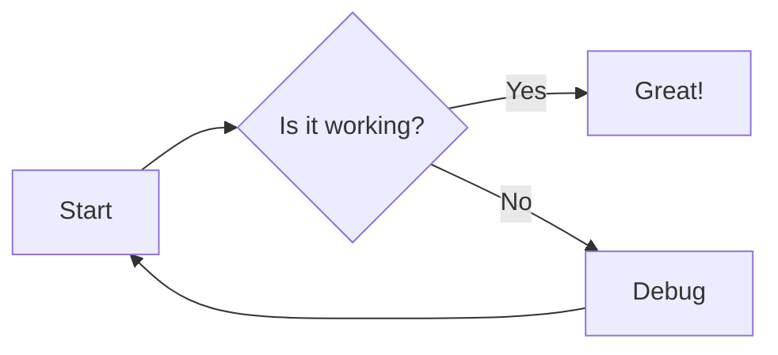
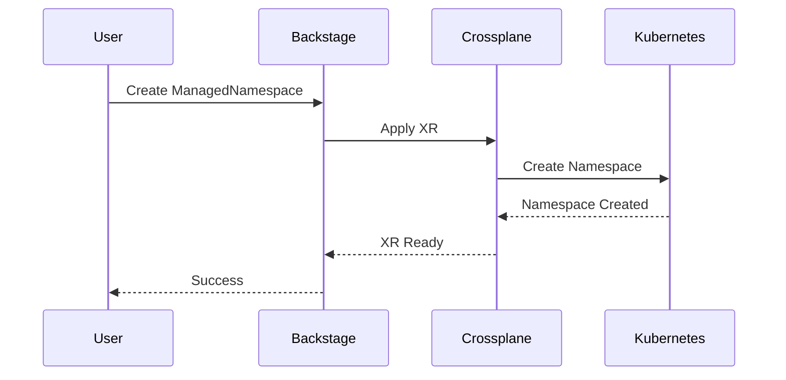
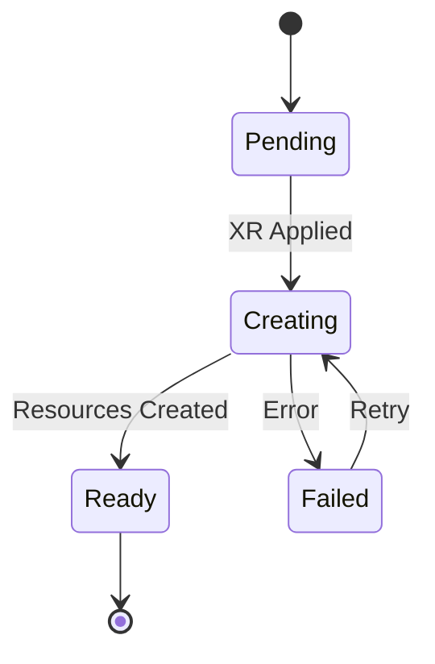
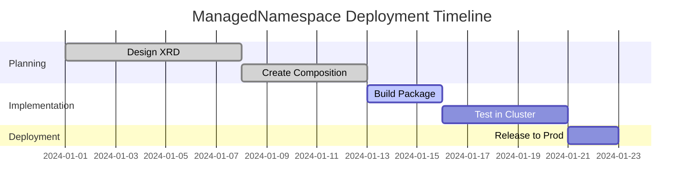
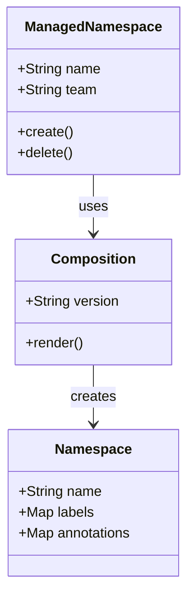
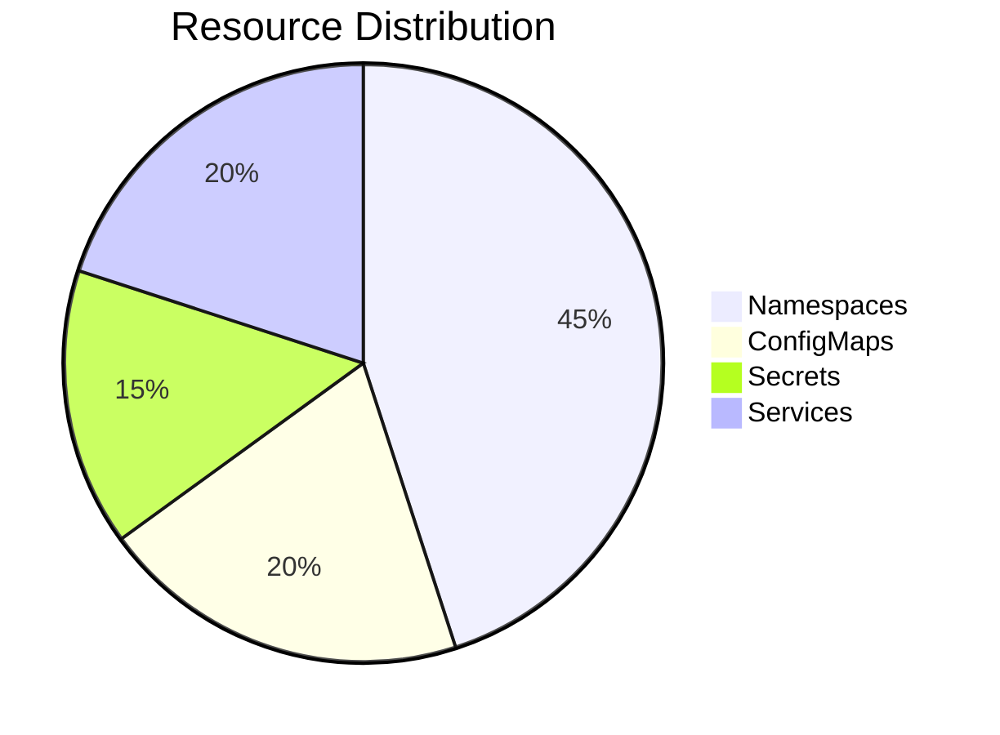

# Mermaid Diagram Test Page

This page tests various mermaid diagram types to ensure the plugin is working correctly.

## Flow Chart

## Sequence Diagram

## State Diagram

## Gantt Chart

## Class Diagram

## Pie Chart

